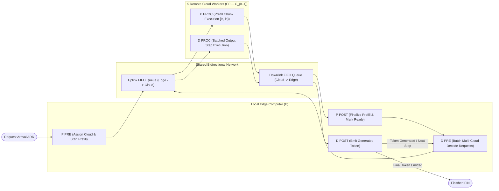
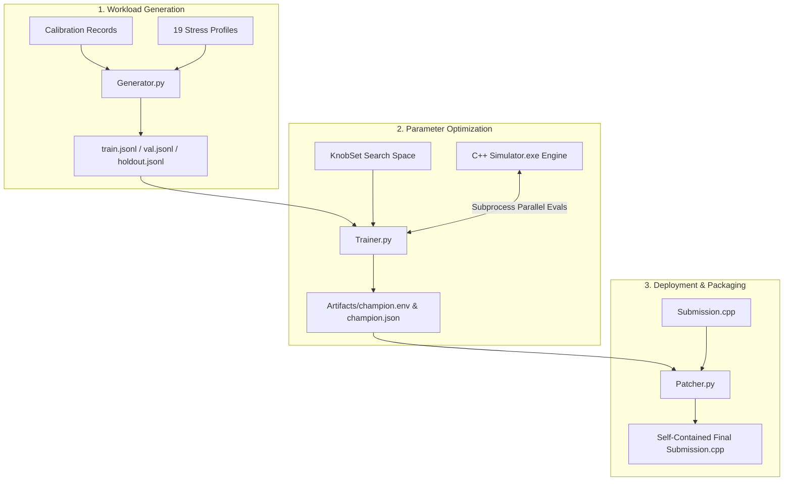

# ⚡ Edge-Cloud Interactive Distributed Task Scheduler

An ultra-high-performance, mathematically grounded scheduling engine and autonomous optimization pipeline designed for hybrid edge-cloud distributed inference. Built to resolve complex compute-network trade-offs under rigid Service Level Objectives (SLOs), non-linear network FIFO transfer queues, and non-preemptive hardware scheduling overheads.

---

## 📑 Table of Contents

- [Overview](#-overview)
- [System Architecture & Lifecycle](#-system-architecture--lifecycle)
- [Mathematical Foundation & Optimization Theory](#-mathematical-foundation--optimization-theory)
  - [1. Max-Plus Task Completion Dynamics](#1-max-plus-task-completion-dynamics)
  - [2. Dynamic FIFO Link Transfer Model](#2-dynamic-fifo-link-transfer-model)
  - [3. Dynamic Decode Batching (Beta-Target & Tau-Holding Policy)](#3-dynamic-decode-batching-beta-target--tau-holding-policy)
  - [4. Adaptive Prefill Chunking (Gamma-Policy)](#4-adaptive-prefill-chunking-gamma-policy)
- [Repository Structure](#-repository-structure)
- [End-to-End Pipeline & Tooling](#-end-to-end-pipeline--tooling)
  - [1. Calibrated Workload Generator (`Generator.py`)](#1-calibrated-workload-generator-generatorpy)
  - [2. Multi-Threaded Discrete-Event Simulator (`Simulator.py` / `Simulator.cpp`)](#2-multi-threaded-discrete-event-simulator-simulatorpy--simulatorcpp)
  - [3. Autonomous Black-Box Hyperparameter Trainer (`Trainer.py`)](#3-autonomous-black-box-hyperparameter-trainer-trainerpy)
  - [4. Real Judge Calibration Suite (`Calibration/`)](#4-real-judge-calibration-suite-calibration)
  - [5. Automated Submission Patcher (`Patcher.py`)](#5-automated-submission-patcher-patcherpy)
  - [6. C++ Knob Extraction Utilities (`cpp_to_json.py`)](#6-c-knob-extraction-utilities-cpp_to_jsonpy)
- [Quick Start Guide](#-quick-start-guide)
  - [Prerequisites](#prerequisites)
  - [Building and Running the Standalone Scheduler](#building-and-running-the-standalone-scheduler)
  - [Running Simulations & Benchmarks](#running-simulations--benchmarks)
  - [Optimizing Hyperparameters](#optimizing-hyperparameters)
  - [Packaging Contest Submissions](#packaging-contest-submissions)
- [19 Stress-Test Profiles](#-19-stress-test-profiles)
- [Mathematical Hyperparameter Knobs](#-mathematical-hyperparameter-knobs)
- [Scoring Formula & Metrics](#-scoring-formula--metrics)
- [Verification & Zero-Score Safety Rules](#-verification--zero-score-safety-rules)

---

## 🔭 Overview

The **Edge-Cloud Interactive Task Scheduler** coordinates jobs between a single local **Edge Computer** ($E$) and $K$ identical **Remote Cloud Workers** ($C_0, C_1, \dots, C_{K-1}$) connected across shared, bidirectional FIFO communication links.

The engine addresses a fundamental challenge in distributed systems: **maximizing throughput while simultaneously minimizing latency** under unknown streaming request arrival distributions, variable sequence lengths, and piecewise-linear compute profiles.



---

## 🏗 System Architecture & Lifecycle

Every request $i$ with input length $L_{\mathrm{in}}[i]$ and hidden output length $L_{\mathrm{out}}[i]$ passes through two primary stages:

### 1. Input Stage (Prefill — Token-Free Setup)
1. **`P PRE <remote> <rid>`** (Local Edge): Binds request $i$ to a chosen cloud worker $k \in [0, K)$. Automatically enqueues an uplink transfer carrying $L_{\mathrm{in}}[i]$ tokens upon completion.
2. **`P PROC <ls> <le> <remote> <rid>`** (Remote Cloud): Computes layers $[ls, le) \subseteq [0, \text{num\_layers})$. Can be executed as one contiguous piece or split across multiple non-overlapping slices. The final slice ($le = \text{num\_layers}$) automatically enqueues a downlink transfer of size $L_{\mathrm{in}}[i]$.
3. **`P POST <remote> <rid>`** (Local Edge): Finalizes the input stage. Marks the end of **Time to Decode Ready (TDR)** and readies the request for token generation.

### 2. Output Stage (Decode — Repeated $L_{\mathrm{out}}[i]$ Times)
1. **`D PRE -1 <m> <rid...>`** (Local Edge): Batches $m \ge 1$ ready requests spanning any combination of remote servers. Automatically forks independent uplink transfers to each represented remote server (enqueued in ascending server ID order).
2. **`D PROC <remote> <m> <rid...>`** (Remote Cloud): Executes the output step for all batch members assigned to that specific cloud worker. Enqueues a downlink transfer of size $m$.
3. **`D POST -1 <m> <rid...>`** (Local Edge): Emits exactly one token per member. When iteration $L_{\mathrm{out}}[i]$ completes, the interactor yields a `FIN` event, retiring the request.

---

## 📐 Mathematical Foundation & Optimization Theory

The scheduling strategy is formally derived in [`Mathematics.md`](Mathematics.md) and governed by the following mathematical primitives:

### 1. Max-Plus Task Completion Dynamics
For any compute task $v$ scheduled on resource $\rho(v) \in \{E, C_0, \dots, C_{K-1}\}$:

$$C_v = \max\left(A_v,\; \max_{u \in \operatorname{Pred}(v)} C_u,\; R_{\rho(v)}\right) + S + d_v$$

- $A_v$: Decision timestamp (frame arrival time).
- $\operatorname{Pred}(v)$: Set of formal prerequisite events (`ARR`, `TDN`, `XDN`).
- $R_{\rho(v)}$: Next available time of the physical execution unit.
- $S$: Fixed scheduling cost overhead ($1 \le S \le 10\text{ ms}$).
- $d_v$: Non-preemptive execution duration interpolated from the task-time table.

### 2. Dynamic FIFO Link Transfer Model
Uplink and Downlink queues operate as independent, non-preemptive single-server FIFO channels:

$$T(\mathrm{len}) = \text{latency} + \frac{8 \cdot \mathrm{len} \cdot \mathrm{BPT}}{\mathrm{BW} \cdot 10^6}$$

$$C(Q_{\mathrm{tail}}) = \max(A_{\mathrm{entry}},\, Q_{\mathrm{tail}}) + T(\mathrm{len})$$

where:
- $\text{latency}$ is link propagation delay in ms (`latency_in_ms`),
- $\mathrm{BPT}$ is payload size per token in bytes (`bytes_per_token`),
- $\mathrm{BW}$ is link bandwidth in Gbps (`bandwidth_gbps`),
- $\mathrm{len}$ is the number of tokens transferred ($L_{\mathrm{in}}[i]$ for prefill, batch size $m$ for decode).

### 3. Dynamic Decode Batching (Beta-Target & Tau-Holding Policy)
Decode efficiency is maximized by adaptively balancing schedule overhead $S$ against latency targets:

$$\beta = \operatorname{clamp}\left(\left\lfloor W_1 \cdot S + W_2 \cdot \frac{w_{\mathrm{tp}}}{w_{\mathrm{tp}} + w_c} - W_3 \cdot \mathrm{SLO}_2 + B_1 \right\rfloor,\; 1,\; \mathrm{batch}_{\max}\right)$$

$$\tau = \max\left(0,\; W_4 \cdot \mathrm{SLO}_2 - W_5 \cdot \text{latency} + B_2\right)$$

- If ready queue size $n \ge \beta$, the batch is dispatched immediately.
- If $n < \beta$, the batch is held for at most $\tau$ ms, unless hold expiration or link starvation forces dispatch.

### 4. Adaptive Prefill Chunking (Gamma-Policy)
Prefill operations on long sequences are split into $\gamma$ chunks to prevent head-of-line blocking on cloud workers:

$$\gamma = \operatorname{clamp}\left(\left\lfloor W_6 \cdot \frac{L_{\mathrm{in}}[i]}{1000} + B_3 \right\rfloor,\; 1,\; N_{\mathrm{layers}}\right)$$

where $N_{\mathrm{layers}}$ is the total number of layers (`num_layers`).

---

## 📂 Repository Structure

```text
Edge-Cloud-Scheduler/
├── Artifacts/                      # Production weights, champion configs, and training metadata
│   ├── champion.env                # Champion hyperparameter export (.env format)
│   └── champion.json               # Full evaluation metadata, profile breakdown, and timestamps
├── Calibration/                    # Real-Judge benchmark logs for rank-order consistency
│   └── Info.md                     # Calibration schema and integration guide
├── Code/                           # Core execution engines and CLI toolchain
│   ├── Generator.py                # Calibrated 19-profile workload generator
│   ├── Simulator.cpp               # OpenMP-accelerated C++ discrete-event simulator core
│   ├── Simulator.py                # Multi-threaded Python simulation CLI runner
│   ├── Simulator.exe               # Compiled C++ simulation binary
│   └── Trainer.py                  # Distributed black-box Bayesian optimizer (Optuna + CMA-ES)
├── Patcher/                        # Contest deployment and source code baking tools
│   ├── Patcher.py                  # Automated .env -> C++ source code injector
│   ├── Submission.cpp              # Self-contained competitive programming submission
│   └── Submission.cpp.bak          # Automatic backup snapshot
├── Schedulers/                     # Modular C++ scheduling library
│   ├── Scheduler.h                 # Re-entrant SchedulerEnv definition & KnobSet struct
│   └── Scheduler.cpp               # High-performance event handlers & decision engine
├── Testcases/                      # Workload datasets and split directories
│   ├── SampleTestcase.txt          # Reference plain-text test case
│   └── Train/                      # Standardized training datasets
│       ├── train.jsonl             # Optimization training split
│       ├── val.jsonl               # Validation gating split
│       └── holdout.jsonl           # Unbiased generalization test split
├── Ultility/                       # Diagnostic and parameter extraction utilities
│   ├── cpp_to_json.py              # Automated C++ source -> JSON knob extractor
│   ├── extract_knobs.py            # Streamlined header regex extractor
│   └── Info.md                     # Utility tool guide
├── Mathematics.md                  # Comprehensive mathematical derivation & formulas
├── ProblemStatement.md             # Official competition task specification & protocol
├── SampleCode.cpp                  # Clean monolithic baseline implementation
└── main.cpp                        # Interactive contest entry-point executable
```

---

## 🛠 End-to-End Pipeline & Tooling



---

### 1. Calibrated Workload Generator (`Generator.py`)

[Generator.py](Code/Generator.py) creates mathematically rigorous, diverse test cases across **19 distinct stress-test profiles**.

#### Key Features:
- **Zero-Score Elimination**: Re-generates any test case that fails or produces 0 points under any known baseline weights.
- **Rank-Order Consistency**: Formally verifies that superior parameter configurations on the real judge maintain strictly higher aggregate scores on the generated benchmark suite.
- **Physically Grounded Scaling**: Dynamically aligns $\mathrm{SLO}_1$, $\mathrm{SLO}_2$, $tp_{\mathrm{base}}$, and $tp_{\mathrm{UB}}$ against theoretical hardware and network lower bounds.

#### CLI Arguments:
| Argument | Flag | Type | Default | Description |
|---|---|---|---|---|
| `num_testcases` | — | `int` | *Required* | Number of test cases to generate. |
| `--output` | `-o` | `str` | `testcases.jsonl` | Target output JSONL filepath. |
| `--seed` | `-s` | `int` | `None` | Random seed for deterministic generation. |
| `--profile` | `-p` | `str` | `None` (mixed) | Generate test cases exclusively for a single profile. |
| `--list-profiles` | — | flag | `False` | Display all available profile names and exit. |
| `--no-calibration`| — | flag | `False` | Skip calibration validation against `Calibration/`. |
| `--calib-dir` | — | `str` | `Calibration` | Path to calibration directory. |

```bash
# Generate 100 balanced test cases across all 19 profiles with calibration verification
python Code/Generator.py 100 -o Testcases/Raw/calibrated_100.jsonl --seed 42

# Generate 20 test cases focusing on network bottleneck conditions
python Code/Generator.py 20 -p network_bottleneck -o Testcases/Raw/net_bottleneck.jsonl
```

---

### 2. Multi-Threaded Discrete-Event Simulator (`Simulator.py` / `Simulator.cpp`)

The simulation engine is written in performance-tuned C++ ([Simulator.cpp](Code/Simulator.cpp)) with multi-core OpenMP parallelization, orchestrated through a flexible Python interface ([Simulator.py](Code/Simulator.py)).

#### Key Features:
- **100% Protocol Fidelity**: Simulates full interactive event frames (`ARR`, `TDN`, `XDN`, `FIN`), piecewise interpolation, and exact score clamping.
- **Zero Heap Allocations**: Utilizes stack-allocated circular buffers and pre-allocated state arrays, processing thousands of simulations per second.
- **Auto-Compilation**: Automatically detects and invokes `g++`, `clang++`, or MSVC `cl.exe` with `-O3 -fopenmp` flags.

#### CLI Arguments:
| Argument | Flag | Type | Default | Description |
|---|---|---|---|---|
| `testcases` | — | `str` | `Testcases/Raw/testcases.jsonl` | Input JSONL test cases file. |
| `--threads` | `-t`, `-j` | `int` | `0` (all cores) | Number of concurrent OpenMP worker threads. |
| `--repeat` | `-r` | `int` | `1` | Evaluation iterations (useful for benchmarking). |
| `--profile` | `-p` | `str` | `""` (all) | Filter evaluation to a specific profile. |
| `--verbose` | `-v` | flag | `False` | Print per-testcase breakdown table. |
| `--json` | — | flag | `False` | Output aggregate results in JSON format. |
| `--rebuild` | — | flag | `False` | Force re-compilation of C++ simulator binary. |

```bash
# Run multi-threaded simulation across all CPU cores with detailed summary
python Code/Simulator.py Testcases/Train/val.jsonl -v

# Run 100 benchmark passes to measure engine execution speed
python Code/Simulator.py Testcases/Train/holdout.jsonl -r 100

# Direct execution via native binary
./Code/Simulator.exe -i Testcases/Train/val.jsonl -v
```

---

### 3. Autonomous Black-Box Hyperparameter Trainer (`Trainer.py`)

[Trainer.py](Code/Trainer.py) uses **Optuna** and **CMA-ES** to discover globally optimal configurations for the mathematical knobs in [`KnobSet`](Schedulers/Scheduler.h#L18).

#### Key Architecture:
- **Cyclic Multi-Phase Search**:
  1. *Multivariate TPE*: Models correlated parameter interactions.
  2. *IPOP CMA-ES*: Local covariance matrix adaptation with restart schedules.
  3. *Multi-Scale Elite Mutation*: Escapes local minima via structured parameter noise.
  4. *Basin Jump & Re-anchoring*: Explores alternate fitness landscapes.
- **Power-Mean Soft-Min Fitness**: Prevents edge-case overfitting by optimizing lower-bound profile scores without sacrificing high-performing profiles.
- **Strict Anti-Overfitting Partitions**: Enforces rigorous `Train` (optimization), `Val` (promotion gating), and `Holdout` (unbiased testing) isolation.
- **Automatic State Resumption**: Checkpoints trials into `study.db` (SQLite) and re-evaluates champion states on startup.

#### CLI Arguments:
| Argument | Flag | Type | Default | Description |
|---|---|---|---|---|
| `--trials` | `-n` | `int` | `50` | Number of optimization trials to execute. |
| `--train-size` | — | `int` | `300` | Number of training split test cases. |
| `--val-size` | — | `int` | `150` | Number of validation split test cases. |
| `--holdout-size`| — | `int` | `150` | Number of holdout split test cases. |
| `--threads` | `-t`, `-j` | `int` | `0` (all cores) | Simulator OpenMP concurrency. |
| `--val-every` | — | `int` | `10` | Frequency of full validation checkpoints. |
| `--reroll-every`| — | `int` | `0` (disabled) | Frequency of dynamic trainset re-rolls. |
| `--study-name` | — | `str` | `scheduler_knobs`| SQLite Optuna study identifier. |
| `--storage` | — | `str` | `sqlite:///study.db` | Persistence database URI. |
| `--seed` | — | `int` | `42` | Global random seed. |
| `--stagnation-window` | — | `int` | `80` | Trials without gain before triggering CMA-ES. |

```bash
# Run standard 100-trial optimization study
python Code/Trainer.py --trials 100 -t 16

# Run large-scale search on dedicated cluster with SQLite persistence
python Code/Trainer.py --trials 2000 -t 32 --train-size 8192 --val-size 4096 --holdout-size 4096 --storage sqlite:///Artifacts/study.db
```

---

### 4. Real Judge Calibration Suite (`Calibration/`)

The calibration framework guarantees alignment between local simulation scores and real contest judge evaluations.

Supported formats inside `Calibration/`:
- **JSON Format (`*.json`)**:
  ```json
  {
    "real_score": 142.50,
    "knobs": {
      "W1": 7.89, "W2": 11.27, "W3": 0.062, "B1": 20.96,
      "W4": 0.73, "W5": 2.53,  "B2": 5.59,  "W6": 17.16,
      "B3": 9.14, "URG_SCALE": 19.88
    }
  }
  ```
- **Bash Environment Files (`*.env`)**:
  ```bash
  # Real Score: 142.50
  export V4_W1=7.890956405387031
  export V4_W2=11.2703639160081
  ```
- **Unified Manifest (`calibration.json` / `calibration.csv`)**: Multi-run tabular calibration logs.

---

### 5. Automated Submission Patcher (`Patcher.py`)

[Patcher.py](Patcher/Patcher.py) reads champion parameters from `.env` files and injects them directly into standalone C++ source files for competition submission.

#### CLI Arguments:
| Argument | Flag | Type | Default | Description |
|---|---|---|---|---|
| `--env` | `-e` | `str` | `Artifacts/champion.env` | Source `.env` configuration file. |
| `--cpp` | `-c` | `str` | `Patcher/Submission.cpp` | C++ target file to patch. |
| `--output` | `-o` | `str` | `None` (in-place) | Output path for patched file. |
| `--backup` | `-b` | flag | `False` | Create `.bak` backup copy before modifying. |
| `--dry-run` | — | flag | `False` | Print unified diff preview without modifying. |
| `--verbose` | `-v` | flag | `False` | Detailed log for every replaced variable. |

```bash
# Preview diff before applying
python Patcher/Patcher.py -e Artifacts/champion.env -c Patcher/Submission.cpp --dry-run

# Apply tuned parameters in-place with backup
python Patcher/Patcher.py -e Artifacts/champion.env -c Patcher/Submission.cpp --backup
```

---

### 6. C++ Knob Extraction Utilities (`cpp_to_json.py`)

[cpp_to_json.py](Ultility/cpp_to_json.py) parses C++ source code, header declarations, or console snippets and exports standardized JSON calibration objects.

```bash
# Extract parameters from source file
python Ultility/cpp_to_json.py main.cpp -o Calibration/main_knobs.json

# Interactive console mode (paste code block and press Ctrl+D/Ctrl+Z)
python Ultility/cpp_to_json.py
```

---

## 🚀 Quick Start Guide

### Prerequisites
- **C++ Compiler**: GCC (`g++` $\ge 9.0$), Clang (`clang++` $\ge 11.0$), or MSVC with OpenMP support.
- **Python**: $\ge 3.10$
- **Dependencies**:
  ```bash
  pip install optuna orjson tabulate
  ```

### Building and Running the Standalone Scheduler

```bash
# Compile the production scheduler
g++ -O3 -std=c++17 main.cpp -o scheduler_app

# Run interactively with standard I/O
./scheduler_app
```

### Running Simulations & Benchmarks

```bash
# 1. Generate validation suite
python Code/Generator.py 500 -o Testcases/Train/val.jsonl --seed 1234

# 2. Run simulation evaluation
python Code/Simulator.py Testcases/Train/val.jsonl -v
```

### Optimizing Hyperparameters

```bash
# Run training study to discover new champion knobs
python Code/Trainer.py --trials 200 --train-size 1024 --val-size 512 -t 16
```

### Packaging Contest Submissions

```bash
# Bake latest champion configuration into contest submission file
python Patcher/Patcher.py -e Artifacts/champion.env -c Patcher/Submission.cpp -o FinalSubmission.cpp
```

---

## 🧪 19 Stress-Test Profiles

To ensure robust generalization, [Generator.py](Code/Generator.py) tests the scheduler across 19 adversarial workload regimes:

| Profile Name | Characteristic Dimensions | Stress Target |
|---|---|---|
| `network_bottleneck` | High latency (35 ms), low bandwidth (0.05 Gbps) | Network FIFO queuing & serialization |
| `fast_network` | Microsecond latency, 100 Gbps bandwidth | Zero-delay link scheduling |
| `compute_bottleneck` | High table compute durations, high $S$ | Compute resource contention |
| `high_schedule_cost` | $S \approx 10\text{ ms}$ | Batch aggregation efficiency |
| `throughput_only` | $w_{\mathrm{tp}} = 1.0, w_c = 0.0$ | Pure token output rate maximization |
| `latency_only` | $w_{\mathrm{tp}} = 0.0, w_c = 1.0$ | Strict TDR and TPOT deadline preservation |
| `balanced` | $w_{\mathrm{tp}} = 0.5, w_c = 0.5$, moderate parameters | General operational equilibrium |
| `single_remote` | $K = 1$ | No multi-worker distribution choice |
| `many_remotes` | $K = 8$ (maximum allowable) | High-concurrency load balancing |
| `burst_arrivals` | All $R$ requests arrive at $t = 0$ | Surge prefill scheduling & memory buffers |
| `streaming_arrivals` | Inter-arrival gaps up to 500 ms | Sparse queue hold/release dynamics |
| `large_prefill` | Large $L_{\mathrm{in}} \le 4096$ | Input stage transfer & prefill pressure |
| `long_decode` | Large $L_{\mathrm{out}} \le 512$ | Long-term decode holding stability |
| `many_layers` | `num_layers` = 64 | Multi-piece prefill splitting granularity |
| `single_layer` | `num_layers` = 1 | Prefill splitting disabled |
| `heavy_transfer` | `bytes_per_token` ≈ 500,000 | Memory footprint and transfer bandwidth |
| `stress_scale` | Near-maximum $R$, $K$, and table constraints | System throughput limits |
| `adversarial_mixed` | Mismatched compute/network bottlenecks | Anti-heuristic robustness |
| `random` | Uniform random sampling across constraint space | Arbitrary edge-case discovery |

---

## 🎛 Mathematical Hyperparameter Knobs

The scheduler's decision thresholds are parameterized by 10 mathematical knobs in [`KnobSet`](Schedulers/Scheduler.h#L18):

| Knob Name | Description | Default Champion Value | Search Bounds |
|---|---|---|---|
| `W1` | Weight of schedule cost $S$ in decode batching target $\beta$ | `7.890956` | $[0.0, 12.0]$ |
| `W2` | Weight of normalized throughput weight in $\beta$ | `11.270364` | $[0.0, 12.0]$ |
| `W3` | Weight of $\mathrm{SLO}_2$ in decode batching target $\beta$ | `0.062483` | $[0.0, 1.0]$ |
| `B1` | Base additive bias in decode batching target $\beta$ | `20.968952` | $[-10.0, 25.0]$ |
| `W4` | Weight of $\mathrm{SLO}_2$ in decode holding time-to-live $\tau$ | `0.732383` | $[0.0, 3.0]$ |
| `W5` | Weight of network latency in holding time-to-live $\tau$ | `2.535072` | $[0.0, 3.0]$ |
| `B2` | Base additive bias in holding time-to-live $\tau$ | `5.590653` | $[-10.0, 20.0]$ |
| `W6` | Weight of input length ($L_{\mathrm{in}} / 1000$) in chunk count $\gamma$ | `17.162321` | $[0.0, 25.0]$ |
| `B3` | Base additive bias in chunk count $\gamma$ | `9.145199` | $[-10.0, 20.0]$ |
| `URG_SCALE`| Global multiplier for latency urgency prioritization | `19.887632` | $[0.1, 25.0]$ |

---

## 📊 Scoring Formula & Metrics

The official evaluation assigns a normalized score in $[0, 1000]$ per test case:

$$\mathrm{Score} = 1000 \cdot \left[ w_{\mathrm{tp}} \cdot \operatorname{clamp}\left(tp;\; tp_{\mathrm{base}},\, tp_{\mathrm{UB}}\right) + w_c \cdot \operatorname{clamp}\left(dist;\; dist_{\mathrm{base}},\, 0\right) \right]$$

### 1. Throughput Component
$$tp = \frac{\sum_{i=0}^{R-1} L_{\mathrm{out}}[i]}{\max_i(\mathrm{FinalToken}_i) - \min_i(\mathrm{Arrival}_i)} \quad (\text{tokens/ms})$$

$$\text{Throughput Component} = \max\left(0,\, \min\left(1,\, \frac{tp - tp_{\mathrm{base}}}{tp_{\mathrm{UB}} - tp_{\mathrm{base}}}\right)\right)$$

### 2. Waiting-Time (Latency) Component
- **$\mathrm{TDR}$**: Mean duration from arrival to prefill completion (`P POST`).
- **$\mathrm{TPOT}$**: Mean interval between consecutive token emissions (`D POST`) across all requests.

$$\mathrm{excess}_{\mathrm{TDR}} = \max\left(0,\, \frac{\mathrm{TDR} - \mathrm{SLO}_1}{\mathrm{SLO}_1}\right), \quad \mathrm{excess}_{\mathrm{TPOT}} = \max\left(0,\, \frac{\mathrm{TPOT} - \mathrm{SLO}_2}{\mathrm{SLO}_2}\right)$$

$$dist = \sqrt{\mathrm{excess}_{\mathrm{TDR}}^2 + \mathrm{excess}_{\mathrm{TPOT}}^2}$$

$$\text{Waiting-Time Component} = \begin{cases} \max\left(0,\, 1 - \frac{dist}{dist_{\mathrm{base}}}\right) & \text{if } dist_{\mathrm{base}} > 0, \\ 1 & \text{if } dist_{\mathrm{base}} = 0 \text{ and } dist = 0, \\ 0 & \text{if } dist_{\mathrm{base}} = 0 \text{ and } dist > 0. \end{cases}$$

---

## 🛡 Verification & Zero-Score Safety Rules

> [!CAUTION]
> The evaluation judge assigns an **immediate 0 score** for any of the following infractions. The scheduler implementation includes strict guards against all of them:

1. **Resource Collision**: Assigning a task to a busy computer, or dispatching multiple tasks to the same resource in a single tick.
2. **Premature Dispatch**: Scheduling a task before all prerequisite `ARR`, `TDN`, or `XDN` events have been explicitly delivered.
3. **In-Flight / Finished Reuse**: Including a request that is currently in-flight or has already completed (`FIN`).
4. **Invalid Cloud Assignment**: Mismatching remote server IDs across prefill or decode steps.
5. **Malformed Chunk Ranges**: Non-contiguous, empty, or out-of-bounds layer ranges $[ls, le)$.
6. **Liveness Violation (Stuck State)**: Halting task dispatches when unfinished requests remain and no in-flight transfers or future events exist.

---

## 📄 License

This project is licensed under the MIT License. See `LICENSE` for details.
